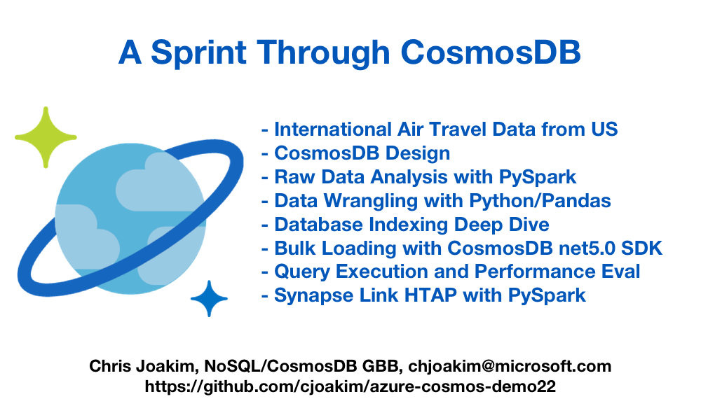

# azure-cosmos-demo22

<p align="center"></p>

- [Presentation](presentation/presentation.md)

---

## This GitHub Repository

- https://github.com/cjoakim/azure-cosmos-demo22

### Directory Structure

```
├── az
│   ├── indexing_policies
│   └── uvm
├── data_wrangling
│   ├── data
│   └── raw_data
├── dotnet
│   └── Cosmos22
├── presentation
│   └── img
└── synapse
    └── pyspark
```