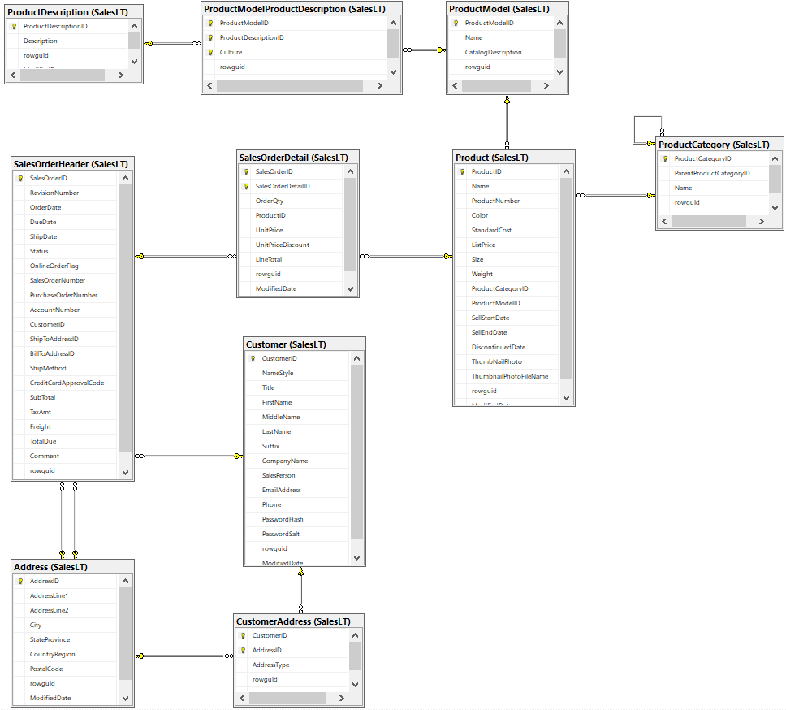
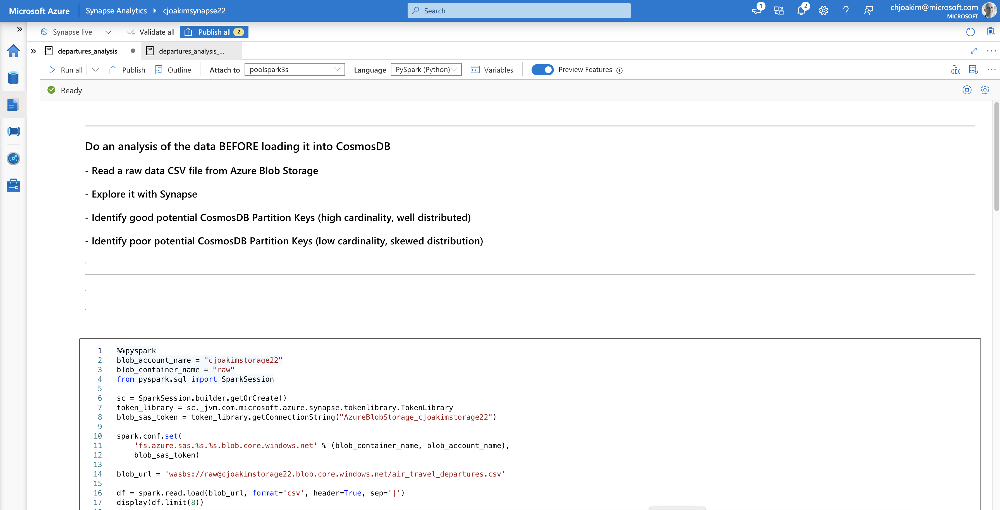
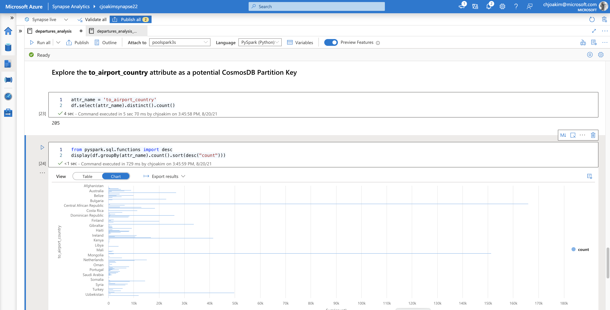
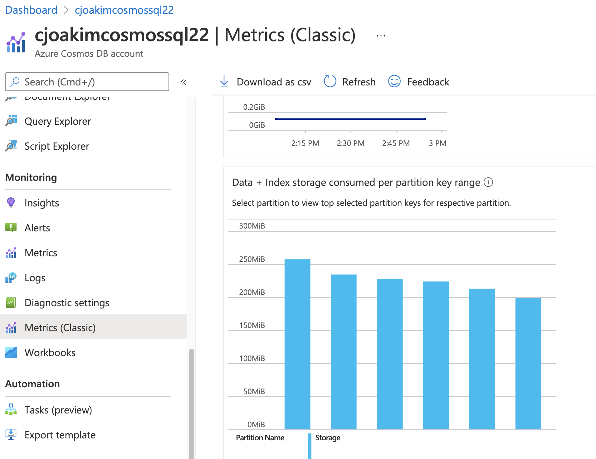

# azure-cosmos-demo22

**CosmosDB - raw data analysis, indexing policies, bulk loading, performance evaluation, and Synapse Link using International Travel Data.**

- Chris Joakim | Azure Cosmos DB Global Black Belt | chjoakim@microsoft.com
- https://github.com/cjoakim/azure-cosmos-demo22

---

## Table of Contents

### 1. Identify the Queries

### 2. Explore and Merge the Datasets

### 3. Explore the data BEFORE loading it into CosmosDB

### 4. Create Similar CosmosDB containers with different Indexing

### 5. Bulk Load the Same Data into the CosmosDB containers

### 6. Execute Cosmos/SQL Queries vs the Containers, Evaluate

### 7. Demonstrate Synapse Link, and PySpark Queries of the Synapse Link Data

### 8. Demonstrate Log Analytics/Azure Monitor Kusto queries

<p align="center"></p>

<p align="center"></p>


### 1. Identify the Queries

- **ALWAYS start here with CosmosDB; the queries**
- This will drive the design of your CosmosDB database and documents

#### CosmosDB Design Reminders

- Don't start with the **shape of the your current data** or the **entitites**
- Please don't port n-relational tables to n-CosmosDB containers
- CosmosDB is schemaless
  - you can (and should) store dissimilar data in the same container
  - use a **doctype** attribute to distinguish the different types of documents
- The choice of the **partition key** for each container is critical
- Optimize queries with **indexing**, including **composite indexes**

#### The Data -  U.S. International Air Traffic

- **Kaggle dataset on U.S. International Air Traffic data (1990-2020)**
- **OpenFlights Airports Database**
- Wrangled into one file, details on this data is in section 2 below

#### The Queries - What is the system supposed to do?

These are ranked by the presumed importance and volume in the system.

| Id   | Description                                                                  |
  :--- | :--------------------------------------------------------------------------- 
| q1   | The travel from a given US airport to Foreign airport (by airport codes)     |
| q2   | Same as q1, but within a given timeframe                                     |
| q3   | The travel from a given US airport to Foreign airport, on a a given Carrier  |
| q4   | Same as 3, but within a given timeframe                                      |
| q5   | Travel to a given Country from all US airports                               |
| q6   | Travel to a given Country from selected US airports                          |
| q7   | Query by Id and Partition Key (i.e. - "Point Read")                          |
| q8   | Query by either from_airport or to_airport by GPS coordinates                |

#### CQRS - Command and Query Responsibility Segregation

- [What is the CQRS pattern?](https://docs.microsoft.com/en-us/azure/architecture/patterns/cqrs)
- A pattern that separates read and update operations for a data store.
- Using CQRS is useful to identify your database operations.

#### Don't Start Here - with what your Current Data Looks Like

<p align="center"></p>

<p align="center"></p>

<p align="center"></p>

### 2. Explore and Merge the Datasets

- [U.S. International Air Traffic data (1990-2020)](https://www.kaggle.com/parulpandey/us-international-air-traffic-data)
  - data on travel from US Airports to Foreign Airports

CSV Line:

```
07/01/2018,2018,7,11057,CLT,36,13180,MBJ,243,19805,AA,1,Departures,250,0,250
```

CSV Fields:

```
0   data_dte          07/01/2018    <-- let's reformat this to sortable yyyy/mm/dd
1   Year              2018
2   Month             7
3   usg_apt_id        11057
4   usg_apt           CLT           <-- from airport code (IATA code)
5   usg_wac           36
6   fg_apt_id         13180
7   fg_apt            MBJ           <-- to airport code (IATA code)
8   fg_wac            243
9   airlineid         19805
10  carrier           AA
11  carriergroup      1
12  type              Departures
13  Scheduled         250
14  Charter           0
15  Total             250
```

- [OpenFlights Airports Database](https://openflights.org/data.html#airport)
  - names and GPS locations of the airports

Example JSON document from OpenFlights CSV data:

```python
  {
    "name": "Charlotte Douglas Intl",
    "city": "Charlotte",
    "country": "United States",
    "iata_code": "CLT",
    "latitude": "35.214",
    "longitude": "-80.943139",
    "altitude": "748",
    "timezone_num": "-5",
    "timezone_code": "America/New_York",
  }
```

#### Merge and Enrich - Joining on Airport Code (IATA Code)

- using python/pandas to combine these datasets
- merged the Openflights Airport data (**Name, GPS, Country**) into the Kaggle Travel data
- made the dates sortable

```python
# warning: this is partial code, see main.py in the repo for the actual code

import pandas as pd

def wrangle_departures():
    df = pd.read_csv(infile, delimiter=",")
    df['route'] = df.apply(lambda row: route_column(row), axis=1)
    df['from_airport_name'] = df.apply(lambda row: from_airport_name(row), axis=1)
    df2 = df.drop(drop_cols, axis=1).drop_duplicates()
    df3 = df2.rename(columns={
        "data_dte": "date", 
        "Year": "year", 
        "Month": "month",
        "usg_apt": "from_iata", 
        "fg_apt": "to_iata", 
        "Total": "count"})
    df3.to_csv(outfile, index=False, sep='|')

def route_column(row):
    iata1, iata2 = row['usg_apt'], row['fg_apt']  # <-- combine existing columns
    return '{}:{}'.format(iata1, iata2).upper()

def from_airport_name(row):
    try:
        iata = row['usg_apt']
        return world_airports_dict[iata]['name']  # <-- Openflights data in a dictionary
    except:
        return 'NA'
```

**Data & AI folks, please learn/explore [Pandas](https://pandas.pydata.org/)!**

<p align="center"></p>

#### The merged/enriched data in in CSV format

- see data_wrangling/data/**air_travel_departures.csv**
- **this CSV data will become CosmosDB documents** in the DotNet Loader process

```
$ head -3 data_wrangling/data/air_travel_departures.csv

date|year|month|from_iata|to_iata|airlineid|carrier|count|route|from_airport_name|from_airport_tz|from_airport_lat|from_airport_lng|to_airport_name|to_airport_country|to_airport_tz|to_airport_lat|to_airport_lng
2006/05/01|2006|5|GUM|MAJ|20177|PFQ|10|GUM:MAJ|Guam Intl|Pacific/Guam|13.48345|144.795983|Marshall Islands Intl|Marshall Islands|Pacific/Majuro|7.064758|171.272022
2003/05/01|2003|5|ANC|OKO|20007|5Y|15|ANC:OKO|Ted Stevens Anchorage Intl|America/Anchorage|61.174361|-149.996361|Yokota Ab|Japan|Asia/Tokyo|35.748492|139.348483
```

#### The CSV is for Exploration, a similar JSON file is for Loading into CosmosDB

```
$ wc data_wrangling/data/air_travel_departures.json
  930808 46374960 559836434 data_wrangling/data/air_travel_departures.json
```

**Awesome, we now have this great dataset!   Should we just load it now into Cosmos?**

<p align="center"></p>

<p align="center"></p>

<p align="center"></p>

### 3. Explore the data BEFORE loading it into CosmosDB

- Identify both good and poor **partition key** attributes
- **Upload the CSV file to Azure Blob Storage**
- Use a **PySpark Notebook in Synapse Analytics** to analyze the data
- see file synapse/pyspark/**departures_analysis.ipynb**

#### Demonstrate the PySpark Notebook in Synapse

<p align="center"></p>

---

<p align="center"></p>


<p align="center"></p>

### 4. Create Similar CosmosDB containers with different Indexing

- **Each of these containers will be loaded with the same data**
- Partition Key and Indexing can impact both loading and query performance
- **pk** attribute to make the container "future-proof"

#### Containers

| Container  | Indexing  | PK Value  | Indexing Policy File                |
  :--------- | :-------- | :-------- | :----------------------------------
| c1         | Default   | route     | az/indexing_policies/default.json   |
| c2         | None      | route     | az/indexing_policies/none.json      |
| c3         | Optimized | route     | az/indexing_policies/optimized.json |
| c4         | Default   | from_iata | az/indexing_policies/default.json   |

#### The CSV Data will be converted into JSON Documents like this

```
{
  "id": "27ca9294-0198-11ec-aed3-ac87a3158cdd",  <-- generated uuid/guid
  "pk": "JFK:POS",                               <-- partition key is the "route"
  "date": "1996/05/01",                          <-- reformatted for sorting
  "year": "1996",
  "month": "5",
  "from_iata": "JFK",
  "to_iata": "POS",
  "airlineid": "19542",
  "carrier": "BW",
  "count": "2019",          
  "route": "JFK:POS",
  "from_airport_name": "John F Kennedy Intl",
  "from_airport_tz": "America/New_York",
  "from_location": {                             <-- GeoJSON format for GPS queries
    "type": "Point",
    "coordinates": [
      -73.778925,
      40.639751
    ]
  },
  "to_airport_name": "Piarco",
  "to_airport_country": "Trinidad and Tobago",
  "to_airport_tz": "America/Port_of_Spain",
  "to_location": {                               <-- GeoJSON format for GPS queries
    "type": "Point",
    "coordinates": [
      -61.337242,
      10.595369
    ]
  },
  "doc_epoch": 1629451355.588681
}
```

#### Indexing Links

- [Include/Exclude Paths](https://docs.microsoft.com/en-us/azure/cosmos-db/index-policy#include-exclude-paths)
- [Composite Indexes Described](https://docs.microsoft.com/en-us/azure/cosmos-db/index-policy#composite-indexes)
- [Composite Index Examples](https://docs.microsoft.com/en-us/azure/cosmos-db/how-to-manage-indexing-policy?tabs=dotnetv2%2Cpythonv3#composite-index)
- [Tim Sander Blog](https://devblogs.microsoft.com/cosmosdb/new-ways-to-use-composite-indexes/)
- [DotNet SDK](https://docs.microsoft.com/en-us/azure/cosmos-db/how-to-manage-indexing-policy?tabs=dotnetv3%2Cpythonv3#dotnet-sdk)
- [GeoJSON](https://geojson.org)

#### The Queries (duplicated from above in section 1) - in English

| Id   | Description                                                                  |
  :--- | :--------------------------------------------------------------------------- 
| q1   | The travel from a given US airport to Foreign airport (by airport codes)     |
| q2   | Same as q1, but within a given timeframe                                     |
| q3   | The travel from a given US airport to Foreign airport, on a a given Carrier  |
| q4   | Same as 3, but within a given timeframe                                      |
| q5   | Travel to a given Country from all US airports                               |
| q6   | Travel to a given Country from selected US airports                          |
| q7   | Query by Id and Partition Key (i.e. - "Point Read")                          |
| q8   | Query by either from_airport or to_airport by GPS coordinates                |

#### The SQL for these Queries - in Pseudocode

| Id   | SQL                                                                                |
  :--- | :--------------------------------------------------------------------------------- 
| q1   | select * from c where c.route = {route}                                            |
| q2   | select * from c where c.route = {route} and c.date >= '{date1}' and c.date <= {date2}  |
| q3   | select * from c where c.route = {route} and c.carrier = '{carrier}'  |
| q4   | select * from c where c.route = {route} and c.carrier = '{carrier}'  and c.date >= '{date1}' and c.date <= {date2} |
| q5   | select * from c where c.to_airport_country = {country}            |
| q6   | select * from c where c.to_airport_country = {country} and c.from_iata in [{codes}] order by c.to_airport_country, c.from_iata  |
| q7   | select * from c where c.id = {id} and c.pk = {pk}             |  
| q8   | select * from c WHERE ST_DISTANCE(c.to_location, {'type': 'Point', 'coordinates':[-77.62575014349154,18.392185491360866]}) <= 100000" |  

#### Identify the primary WHERE clause fields for the Queries

- route (or pk)
- date
- carrier 
- to_airport_country
- from_iata

#### Identify the WHERE clause field Tuples for Composite Indexes

- route, date  (q2)
- route, carrier (q3)
- route, carrier, date (q4)
- to_airport_country, from_iata (q6)

#### Indexing Policy - default.json

Wildcard pattern on all paths.

```json
{
  "indexingMode": "consistent",
  "automatic": true,
  "includedPaths": [
    {
      "path": "/*"
    }
  ],
  "excludedPaths": [
    {
      "path": "/\"_etag\"/?"
    }
  ]
}
```

#### Indexing Policy - none.json

No Indexing - simply use CosmosDB as a key-value store!

```json
{
  "indexingMode": "none",
  "automatic": false,
  "includedPaths": [],
  "excludedPaths": []
}
```

#### Indexing Policy - optimized.json

Optimized for the specific queries required by the application requirements.

Use the **/?** syntax for scalar values with no child attributes.

```json
{
  "indexingMode": "consistent",
  "automatic": true,
  "includedPaths": [
    {
      "path": "/pk/?"
    },
    {
      "path": "/route/?"
    },
    {
      "path": "/date/?"
    },
    {
      "path": "/carrier/?"
    },
    {
      "path": "/to_airport_country/?"
    },
    {
      "path": "/from_iata/?"
    }
  ],
  "excludedPaths": [
    {
      "path": "/*"
    }
  ],
  "compositeIndexes": [
    [
      {
        "path": "/pk",
        "order": "ascending"
      },
      {
        "path": "/date",
        "order": "ascending"
      }
    ],
    [
      {
        "path": "/pk",
        "order": "ascending"
      },
      {
        "path": "/carrier",
        "order": "ascending"
      }
    ],
    [
      {
        "path": "/pk",
        "order": "ascending"
      },
      {
        "path": "/carrier",
        "order": "ascending"
      },
      {
        "path": "/date",
        "order": "ascending"
      }
    ],
    [
      {
        "path": "/to_airport_country",
        "order": "ascending"
      },
      {
        "path": "/from_iata",
        "order": "ascending"
      }
    ]
  ]
}
```

Composite paths have an **implicit /?** since only the scalar value at that path is indexed. 

#### Apply the Indexing Policies to the Containers

```
$ ./cosmos_index_update.sh <db> <container> <policy.json> <-- format of the following commands

$ ./cosmos_index_update.sh demo c1 default.json
$ ./cosmos_index_update.sh demo c2 none.json
$ ./cosmos_index_update.sh demo c3 optimized.json
$ ./cosmos_index_update.sh demo c4 default.json
```

See the az/ and az/indexing_policies/ directories of this repo.

```shell
    echo 'az cosmosdb sql container update ...'
    az cosmosdb sql container update \
        --resource-group $cosmos_sql_rg \
        --account-name $cosmos_sql_acct_name \
        --database-name $1 \
        --analytical-storage-ttl -1 \
        --name $2 \
        --idx @indexing_policies/$3 \
        > tmp/cosmos_index_update_$2.json
```

#### Create CosmosDB Database, Containers, and Apply the Index Policies

```
$ cd dotnet/Cosmos22/CosmosConsole22

$ dotnet build

$ ./recreate_cosmos_database.sh
```

The above uses the **CosmosDB C# SDK** to recreate the database and containers,
and the **az CLI** to apply the index policies.  The **CosmosDB C# SDK** will
also be used to execute the CosmosDB **queries**.

See the az/ and az/indexing_policies/ directories of this repo.

<p align="center"></p>

### 5. Bulk Load the Same Data into the CosmosDB containers

- C#, net5.0, CosmosDB SDK, and Bulk Executor functionality
- On an Ubuntu Linux VM.  **Yes, C# and net5.0 on Linux.**
- Measure Load Performance

#### CosmosDB C# SDK and Bulk Executor

- https://docs.microsoft.com/en-us/dotnet/api/microsoft.azure.cosmos.cosmosclient?view=azure-dotnet
- https://docs.microsoft.com/en-us/azure/cosmos-db/bulk-executor-overview
- https://docs.microsoft.com/en-us/azure/cosmos-db/tutorial-sql-api-dotnet-bulk-import

#### Load all four containers in sequence

The loads were executed on an Ubuntu Linux VM.  

```
$ ./load_all.sh
```

#### Load c1 

```
...
writing batch 1860 (500) at 1629482022429
writing batch 1861 (500) at 1629482022612
writing batch 1862 (308) at 1629482022812

EOJ Totals:
  Database:             demo22
  Container:            c1
  Input Filename:       /home/cjoakim/azure-cosmos-demo22/data_wrangling/data/air_travel_departures.json
  Max Batch Count:      999999999
  BulkLoad startEpoch:  1629481701005
  BulkLoad finishEpoch: 1629482022938
  BulkLoad elapsedMs:   321933
  BulkLoad elapsedSec:  321.933
  BulkLoad elapsedMin:  5.36555
  Batch Size:           500
  Batch Count:          1862
  Exceptions:           0
  Document/Task count:  930808
  Document per Second:  2891.3096824494537
```

The output for loading containers c2, c3, and c4 is similar.

#### Load Time Summary 

The loads were executed on an Ubuntu Linux VM, in the same Azure Region
as the CosmosDB, and with the same input file containing 930,808 rows/documents.

| Container  | Indexing  | PK Value  | Load Time Minutes    |
  :--------- | :-------- | :-------- | :--------------------
| c1         | Default   | route     | 5.36555              |
| c2         | None      | route     | 4.7692499999999995   |
| c3         | Optimized | route     | 5.064233333333333    |
| c4         | Default   | from_iata | 6.03395              |

Notes:
- c2 with no indexing was the fastest, but not significantly
- c3 has less indexing than c1, so was slightly faster
- c4 may have been slower due to the lower-cardinality partition key

#### After Load - Storage By Partition, container c1

<p align="center"></p>

---

<p align="center"></p>

### 6. Execute Cosmos/SQL Queries vs the Containers, Evaluate

- https://docs.microsoft.com/en-us/azure/cosmos-db/troubleshoot-query-performance
- https://docs.microsoft.com/en-us/azure/cosmos-db/query-cheat-sheet
- https://docs.microsoft.com/en-us/azure/cosmos-db/working-with-dates

#### Query 0

```
SELECT COUNT(1) FROM c
```

| Query | DB     | Ctr | RU       | Items | Status |
  :---- | :----- | :-- | :------- | :---- | :----- 
| q0    | demo22 |  c1 |   17.340 | 1     | OK |
| q0    | demo22 |  c3 |   17.440 | 1     | OK |
| q0    | demo22 |  c4 |   17.360 | 1     | OK |

Notes:
- Results comparable as expected
- each returned a count of 930,808
- container c2, with no indexing, only supports "point reads"

---

#### Query 1

```
q1  | select * from c where c.pk = 'MIA:EZE'
q1l | select * from c where c.pk = 'MIA:EZE' offset 0 limit 5
q1r | select * from c where c.route = 'MIA:EZE'
```

| Query | DB     | Ctr | RU       | Items | Status |
  :---- | :----- | :-- | :------- | :---- | :----- 
| q1    | demo22 |  c1 |  171.970 | 2613  | OK |
| q1    | demo22 |  c3 |  171.970 | 2613  | OK |
| q1l   | demo22 |  c1 |    2.990 | 5     | OK |
| q1l   | demo22 |  c3 |    2.990 | 5     | OK |
| q1r   | demo22 |  c4 |  185.720 | 2613  | OK |

Notes:
- c4 has a partition key of "/from_iata"
- notice the offset/limit clause
- c4 RU cost is 8.0% higher to get the same 2613 documents

---

#### Query 2

```
q2  | select * from c where c.pk = 'CLT:MBJ' and c.date >= '2004/01/01' and c.date <= '2018/02/01'
q2r | select * from c where c.route = 'CLT:MBJ' and c.date >= '2004/01/01' and c.date <= '2018/02/01'
```

| Query | DB     | Ctr | RU       | Items | Status |
  :---- | :----- | :-- | :------- | :---- | :----- 
| q2    | demo22 |  c1 |   14.730 | 180   | OK |
| q2    | demo22 |  c3 |   12.650 | 180   | OK |
| q2r   | demo22 |  c4 |   29.300 | 180   | OK |

Notes:
- c3 costs less RU than c1 due to the composite index on pk/date
- c4 costs much more due to non-use of the partition key (/from_iata)

---

#### Query 3

```
q3  | select * from c where c.pk = 'CLT:MBJ' and c.carrier = 'AA'
q3r | select * from c where c.route = 'CLT:MBJ' and c.carrier = 'AA'
```

| Query | DB     | Ctr | RU       | Items | Status |
  :---- | :----- | :-- | :------- | :---- | :----- 
| q3    | demo22 |  c1 |    5.160 | 57    | OK |
| q3    | demo22 |  c3 |    5.060 | 57    | OK |
| q3r   | demo22 |  c4 |   19.110 | 57    | OK |

Notes:
- c3 costs less RU than c1 due to the composite index on pk/carrier
- c4 costs much more due to non-use of the partition key (/from_iata)

---

#### Query 4

```
q4	| select * from c where c.pk = 'CLT:MBJ' and c.carrier = 'AA' and c.date >= '2004/01/01' and c.date <= '2018/02/01'
q4r	| select * from c where c.route = 'CLT:MBJ' and c.carrier = 'AA' and c.date >= '2004/01/01' and c.date <= '2018/02/01'

```

| Query | DB     | Ctr | RU       | Items | Status |
  :---- | :----- | :-- | :------- | :---- | :----- 
| q4    | demo22 |  c1 |    6.050 | 32    | OK |
| q4    | demo22 |  c3 |    4.130 | 32    | OK |
| q4r   | demo22 |  c4 |   18.960 | 32    | OK |

Notes:
- c3 costs much less RU than c1 due to the composite index on pk/carrier/date
- c4 costs much more due to non-use of the partition key (/from_iata)
- Usain Bolt uses composite indices

<p align="center"></p>

---

#### Query 5

```
select * from c where c.to_airport_country = 'Jamaica'
```

| Query | DB     | Ctr | RU       | Items | Status |
  :---- | :----- | :-- | :------- | :---- | :----- 
| q5    | demo22 |  c1 | 1099.349 | 16806 | OK |
| q5    | demo22 |  c3 | 1099.449 | 16806 | OK |
| q5    | demo22 |  c4 | 1095.760 | 16806 | OK |

Notes:
- similar results for all containers, all have index on to_airport_country

---

#### Query 6

```
select * from c where c.to_airport_country = 'Jamaica' and c.from_iata in ('MIA','RDU')
```

| Query | DB     | Ctr | RU       | Items | Status |
  :---- | :----- | :-- | :------- | :---- | :----- 
| q6    | demo22 |  c1 |  252.390 | 3493  | OK |
| q6    | demo22 |  c3 |  250.990 | 3493  | OK |
| q6    | demo22 |  c4 |  242.170 | 3493  | OK |

Notes:
- similar results for all containers, all have index on to_airport_country and from_iata

---

#### Query 7

```
q7 c1 | select * from c where c.id = 'eb48ff62-e0c6-453f-9752-850307b69d78' and c.pk = 'CLT:MBJ'
q7 c2 | select * from c where c.id = 'b0f94dae-dd47-400e-ade6-3c4a0dcff5be' and c.pk = 'MIA:KIN'

```

| Query | DB     | Ctr | RU       | Items | Status |
  :---- | :----- | :-- | :------- | :---- | :----- 
| q7    | demo22 |  c1 |    2.930 | 1     | OK |
| q7    | demo22 |  c2 |    2.830 | 1     | OK |

Notes:
- Results very similar despite minimal no-indexing on c2 for point reads

---

#### Query 8

```
select * from c WHERE ST_DISTANCE(c.to_location, {'type': 'Point', 'coordinates': [-77.6257501434915, 18.392185491360866]}) <= 40000 offset 0 limit 1
```

| Query | DB     | Ctr | RU       | Items | Status |
  :---- | :----- | :-- | :------- | :---- | :----- 
| q8    | demo22 |  c1 |    4.350 | 1     | OK |
| q8    | demo22 |  c3 |    2.450 | 1     | OK |
| q8    | demo22 |  c4 |    2.530 | 1     | OK |

Notes:
- query finds first airport within 40km of Usain Bolt's hometown, Sherwood Content, Jamaica
- https://docs.microsoft.com/en-us/azure/cosmos-db/index-policy#spatial-indexes
- https://docs.microsoft.com/en-us/azure/cosmos-db/sql/sql-query-geospatial-index
- Add **spatialIndexes**, as shown below

```
{
    "automatic": true,
    "indexingMode": "Consistent",
    "includedPaths": [
        {
            "path": "/*"
        }
    ],
    "spatialIndexes": [
        {
            "path": "/*",
            "types": [
                "Point",
                "Polygon",
                "MultiPolygon",
                "LineString"
            ]
        }
    ],
    "excludedPaths": []
}
```

<p align="center"></p>

### 7. Demonstrate Synapse Link, and PySpark Queries of the Synapse Link Data

- https://github.com/Azure-Samples/Synapse/tree/main/Notebooks/PySpark/Synapse%20Link%20for%20Cosmos%20DB%20samples
- https://sparkbyexamples.com/pyspark/pyspark-structtype-and-structfield/

<p align="center"></p>

<p align="center"></p>


### Summary 


<table style="width:100%">
  <tr>
    <td>
      <tr>
        <td width="50%">
          <p>&nbsp;</p>
          <p>&nbsp;</p>
          <p>&nbsp;</p>
          </td>
        <td>
          <ul>
            <li> Define your Queries First </li>
            <li> Partition Keys are Critical </li>
            <li> Know your data BEFORE Loading it into Cosmos </li>
            <li> Shape your data for your queries, not vice versa </li>
            <li> Indexing to Optimize your Queries </li>
            <li> Composite Indexes to make your Queries fly </li>
            <li> Synapse Link offers "Free ETL" - OLAP vs HTAP </li>
            <li> Look at Pandas, and PySpark too.  Dataframes </li>
            <li> Questions? </li>
            <li> Thank you! </li>
            <li> chjoakim@microsoft.com </li>
          </ul>
        </td>
      </tr>
    </td>
  </tr>
</table>
